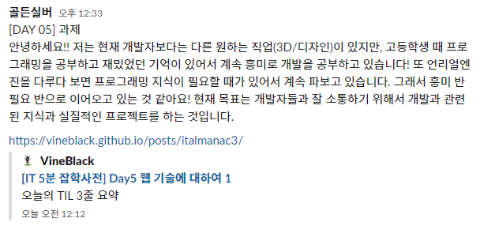

## 오늘의 TIL 3줄 요약

- 라이브러리와 프레임워크는 제어권에 따라서 차이점이 있다. 
- API는 앱과 앱을 연결하는 매개체이다. 예시로 웹 API가 있다.
- 도메인 시스템을 제대로 관리하기 위해서는 '레지스트리'가 필요하며 기업에서 운영한다.

## TIL (Today I Learned)
마당 02. 코딩별 안내서 - 웹 기술 편
- **ep11. 라이브러리와 프레임워크, 비슷한 거 아냐?**
- **ep12. 제이쿼리는 반드시 배워야 하는 기술일까?**
- **ep13. 그놈의 API, 대체 뭐길래?**
- **ep14. 도메인은 왜 돈을 주고 사야 할까?**
- **ep15. 플래시의 서비스 종료와 스티브 잡스**

## 책에서 기억하고 싶은 내용

- **라이브러리 VS 프레임워크**
  미리 작성해 놓은 코드. 개발 속도를 더 빠르게 만들어 주는 도구이다.
  - **라이브러리**
    - 어떤 도구에 대해서 모든 결정을 다 내리고 있다. 교체 난이도가 쉽다.
    - 제이쿼리(jQuery), 부트스트랩(bootstrap), 시맨틱 UI(Semantic UI), 테일윈드 CSS(Tailwind CSS)
  - **프레임워크**
    - 누군가 정한 규칙에 따라 도구를 사용하고 있다. 교체 난이도가 어렵다.
    - [장고(Django)](https://docs.djangoproject.com/en/4.0/), 스프링(Spring)
  
- **제이쿼리와 자바스크립트**
  - 제이쿼리는 2006년에 탄생했다. 사람들은 브라우저 호환 문제와 오류를 줄일 수 있는 제이쿼리를 사용했다. HTML, CSS를 배운 다음에 제이쿼리를 공부했을 정도로 많이 사용했다. 하지만 자바스크립트가 ES2015, ES2016, ES2017을 거치면서 좋아졌고, 제이쿼리를 사용할 이유가 없어졌다. 제이쿼리는 필요할 때만 배우자.

- **API(Application Programming Interface)**
  - 역할 : 키보드로 컴퓨터와 사용자가 대화하는 것처럼, API는 프로그램끼리 소통할 수 있게 한다.
  - 예시 : 웹 API의 마이크 접근 권한 기능을 사용해보자. 그러면, 크롬 브라우저와 마이크를 연결하는 코드를 내가 직접 만들지 않아도 크롬 브라우저에서 마이크 기능을 간단하게 사용할 수 있다.

- **도메인**

  | 목록 순서 | 이름           | IP 주소         |
  |----------|----------------|-----------------|
  | 1        | naver.com      | 202.131.30.11   |
  | 2        | google.com     | 173.194.126.240 |
  | 3        | easyspub.co.kr | 183.111.161.94  |

  - 도메인 시스템 : 전화번호부와 같은 것이다. naver.com을 입력하는 순간, 브라우저는 도메인 시스템에서 google.com의 IP주소를 찾는다.
  - 레지스트리 : 도메인 시스템을 관리하기 위해 필요한 것. 유명한 레지스트리는 닷컴(.com)으로, 관리는 베리사인(Verisign) 회사에서 한다.
  - 도메인 구매(리셀러) : 도메인을 레지스트리에 등록하는 과정이 매우 복잡하다. 고대디(GoDaddy), 가비아(gabia), 후이즈(Whois) 등
  - 레지스트리를 운영 : 국제 인터넷 주소 관리 기구인 아이캔(ICANN)에 신청하면 된다. 엄청난 돈과 인프라가 필요하다.

- **플래시의 서비스 종료와 스티브 잡스 - 웹 표준 탄생**
  - 2020년 12월 31일, 어도비 플래시(Adobe Flash)가 공식적으로 서비스 종료 발표한다.
  - 매크로미디어 회사가 퓨쳐웨이브  소프트웨이를 인수해 이름을 플래시로 바꾼다. '애니메이션을 브라우저에 띄울 수 있게 해주는 프로그램'의 가능성을 보았다. 플래시가 등장하기 전에는 인터넷에서 영상을 볼 수 없었다.
  - 스티브잡스가 iOS에서 플래시 사용을 전면 금지하게 했다. 플래시는 오픈소스가 아니여서 웹에 참여하기 위해서는 어도비 회사에 의존할 수 밖에 없었다. 또한, 플래시와 상호작용하려면 마우스를 활용해야 했고, 손가락 터치를 활용하는 iOS와 맞지 않았다. 추가로 보안 이슈가 많았다. 
  - 플래시를 대체할 만한 기술이 HTML5와 CSS3에 도입되었고, 웹 표준이 생겼다!

## 오늘 읽은 소감은? 떠오르는 생각을 가볍게 적어보기

- '프로젝트 체크리스트'라는 말이 인상 깊었다. 기한을 추가해서 공부해야 겠다.
- 웹 표준이 탄생하게 된 역사를 살펴보는 일이 흥미로웠고 즐거웠다. 
- API의 동작 원리가 궁금해졌다. 책에서 말한 것처럼, API를 직접 개발해보고 싶다.

## 궁금한 내용과 잘 이해되지 않는 내용

- '도메인', '도메인 시스템', '레지스트리' 등 정확한 개념이 궁금하다.

## 과제2 : 내가 개발을 공부하는 이유는?

